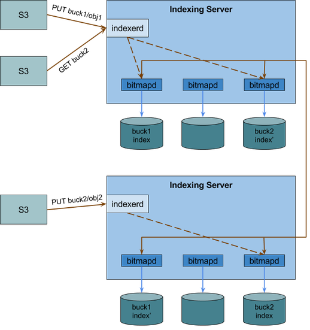

# Indexing design

Currently the S3 API only supports search and retrieval of an object based on its unique key. However, various use cases
require the ability to search for objects through metadata attributes since the exact object key is not available. An 
example is a lifecycle management application, that selects files for deletion based on their size and the date of their 
last modification.

The goal of the indexing module is to provide the capability to efficiently search objects based on various metadata 
attributes. 

## Object Metadata

There are two kinds of object metadata: system metadata and user-defined metadata.

* **System metadata** is used and processed by the S3 implementation. The following table provides some a list of some 
system metadata:

Name | Description 
-----|-------------
Content-Length | Object Size in Bytes
Last-Modified | Date of creation or last modification
Owner-id | Object's owner canonical user ID
Content-Type | Two-part identifier conveying content format information
Content-MD5 | Base64-encoded 128-bit MD5 digest of the object
Access Control List (ACL)| Information about which accounts/groups are granted access to the object and the type of access

* **User-defined metadata** can be optionally assigned to an object. They are formatted as key-value pairs. When uploading 
an object using the REST API, each user-defined metadata attribute is created by adding an HTTP header that begins with
`x-amz-meta-`. For example, the header `x-amz-meta-location:Paris` specifies the key-value attribute `location:Paris`. We 
refer to user-defined metadata as tags.

## Indexing Scheme

Let's consider a table representing the Content-Type metadata attribute. Each object is associated to a unique row 
identifier (rowId).

Generally, an index provides pointers to the rows of the table that have a particular value. A basic index stores a list 
of rowIds for each value corresponding to the rows with that value.

The main idea of our indexing scheme is the use of ***bitmap indexing***. Using a bitmap indexing, we represent the list of rowIds as a bitmap. A bitmap represents a bit sequence. Each bit position corresponds to an object. There is a bitmap for each value of the attribute. If the bit is set (has value 1), then the corresponding object has the attribute value that the bitmap represents.

In the following example, there is a bitmap for each value of the `Content-Type` column. For example, the column `text/html`contains the bitmap `100010`, indicating that the objects with rowIds 0, 4 have the value `text/html` as their `Content-Type`.

RowId | Content-Type | text/html | application/json | image/png | video/mp4
------|--------------|-----------|------------------|-----------|----------
0 | text/html | 1 | 0 | 0 | 0
1 | application/json | 0 | 1 | 0 | 0
2 | image/png | 0 | 0 | 1 | 0
3 | video/mp4 | 0 | 0 | 0 | 1
4 | text/html | 1 | 0 | 0 | 0
5 | image/png | 0 | 0 | 1 | 0

In that way we can respord to exact match queries simply by finding the bit positions that are set in the corresponding 
bitmap. The described encoding is refered to as equality encoding

### Range queries

Although optimized for exact match queries, the equality encoding is not efficient for implementing range queries in ordered 
data, such as integers. Several other encodings are more efficient for processing range queries:

* **Binning** partitions the attribute values into ranges. Each bitmap represents a range rather than a unique value.

RowId | Content-Length (MB) | [0:1024) | [1024:2048) | [2048:3072) | [3072:4096) | [4096:5120)
------|--------------|------------|-------------|-------------|-------------|------------
0 | 4890 | 0 | 0 | 0 | 0 | 1
1 | 1589 | 0 | 1 | 0 | 0 | 0
2 | 861 | 1 | 0 | 0 | 0 | 0
3 | 2533 | 0 | 0 | 1 | 0 | 0
4 | 2957 | 0 | 0 | 1 | 0 | 0
5 | 4519 | 0 | 0 | 0 | 0 | 1

Although binning may reduce storage costs, it may increase the costs of queries that do not fall on the exact bin 
boundaries, as it may require partial search of the stored data. This encoding is useful for two-sided range queries.

* In **range encoding** each bitmap represents a range of values `[0, v]`. 

RowId | Content-Length | [0:1024] | [0:2048] | [0:3072] | [0:4096] | [0:5120]
------|----------------|----------|----------|----------|----------|---------
0 | 4890 | 1 | 1 | 1 | 1 | 1
1 | 1589 | 1 | 1 | 0 | 0 | 0
2 | 861 | 1 | 0 | 0 | 0 | 0|
3 | 2533 | 1 | 1 | 1 | 0 | 0
4 | 2957 | 1 | 1 | 1 | 0 | 0
5 | 4519 | 1 | 1 | 1 | 1 | 1

This encoding is useful for one-sided range queries which can be processed using bitwise operations between bitmaps. Two-sided queries.

* The **interval encoding** scheme, which is efficeint both for one-sided and two-sided range queries, consists of overlapping ranges. In the above example the ranges could be `[0:2048], [1024:3072], [2048:4096], [3072:5120]`.

Moreover, dynamic programming can be used to determine the optimal partition of attribute values into ranges, based on query 
access patterns.

## Compression

Although the use of bitmap indexing is efficient for low-cardinality attributes, it presents considerable storage overhead for high-cardinality attributes, containing many distinct values. A common way to reduce memory requirements is the use of 
bitmap compression. An efficient bitmap compression scheme must not only reduce the size of bitmaps but also perform bitwise 
operations efficiently. 

Research has demostrated that the two most efficient bitmap compression techniques are the Byte-Aligned Bitmap Code (BBC) 
and the World-Aligned Hybrid (WAH) Code. The WAH compression scheme reduces the overall query time significantly compared to 
BCC. Both schemes are based in the idea that long runs of 1s or 0s can be represented with shorter words, called run-length 
encoding.

## Implementation

The indexing and search system is implemented as a module that communicates with the storage system about updates and queries through a communication channel. Currently the communication is implemented using TCP sockets.

### Indexing

The current system uses ***equality encoding*** for text attributes and ***range encoding*** for integers, and thus supports exact match queries on text and range queries on integer attributes.

Ranges in the range bitmap encoding are not predefined, but dynamically adapt as new values are added, so that each range 
includes a single existing value. For example, if an attribute contains the values `{2, 5, 10}` the ranges are `[0,2], 
[0,5], [0,10]`. If then the value `7` is added the ranges are adapted as `[0,2], [0,5], [0, 7] [0,10]`. In that way any exact match or one-sided range query can be answered using at most one bitmap operation (e.g. a search for the values `<= 5` can be answered by an `XOR` between the bitmaps for `[0,5]` and `[0,7]`  This aims at fast query responses, but can lead to significant storage overhead in case the attribute has a large number of different values.

The bitmap data structure implementation is based on a C++ implementation (https://github.com/lemire/ewahboolarray) which 
uses the Enhanced World-Aligned Hybrid (EWAH) Code compression scheme.

The metadata attributes that are indexed by the system so far are:
* **User-defined attributes**: They are treated as text by default, unless they are at the special form `key--integer:value`
when they are treated as integers, and range queries are supported.
* **Content-Length**: Object size in bytes. 
* **Last-Modified**: Date of last modification. Dates are split in years, months, days, hours and minutes and indexed 
separately.
* **Content-Type**: Type and subtype specifier about the object's format.
* **ACL**: Access control list specifying the permissions for specific object operations granted to users or groups. 
The types of permissions are READ, WRITE, READ_ACP, WRITE_ACP, FULL_CONTROL, and Canned (predefined permissions).

### Search

A query is performed by sending an `HTTP GET` request with a custom header. Each query refers to a single bucket. 
Queries can include searches for different attributes and contain logical operators. The form of the custom header is 
`query:expression`, where an `expression` can have the following forms:
* `operator&expression&expression` where `operator` is `op/AND` or `op/OR`
* `operator&expression` where `operator` is `op/NOT`. Using these forms we can express complex logical expressions using the Prefix (Polish) notation (e.g. `(exp1 && exp2) || (!exp3)` is expressed as 
`op/OR&op/AND&expr1&expr2&op/NOT&exp3`
* `attribute/value` where `attribute` is one of the indexed metadata attributes and `value` a text value. 
The supported attributes are:
  * `contenttype` and `contentsubtype`
  * `acl`
  * `x-amz-meta-key/value` where `key`, `value` are specific user-defined text attributes.
  For example we can search for objects where `Content-Type = text` using the header `query:contenttype/text` or for 
  objects that contain the tag location:Paris using the header `query:x-amz-meta-location/Paris`
* `attribute/op/value` where `op` is one of the `=`, `<`, `>`, `<=`, `>=`
The supported attributes are:
  * `filesize`
  * `modificationdate`
  * `x-amz-meta-key--integer/value` where `key`, `value` are specific user-defined integer attributes.
  For example we can search for objects where `Content-Length > 1024` using the header `query:contentlength/>/1024`.
  
### System architecture

The described design refers to a single indexing node. We will now expand by designing a replication and partitioning scheme 
that enables the indexing service to scale more efficiently.

The building block of the system is a bitmap daemon referred to as `bitmapd`, that is responsible for receiving updates, 
maintaining indexed data and responding to queries. The namespace is partitioned among multiple `bitmapd`s. Each one 
is assigned a set of buckets to index and respond to queries about. 

Additionally, multiple `bitmapd`s form a replication group. They replicate the index structure in order to provide 
availability and tolerate failure of a minority.

The system also contains an API daemon named `indexerd`, which receives data updates and queries from the storage system 
and dispatches them to the correspond `bitmapd`s according to a mapping. Its aim is to make the replication and partitioning 
mechanism transparent to the storage system and the end users.

The following diagram depicts the indexing system architecture:

